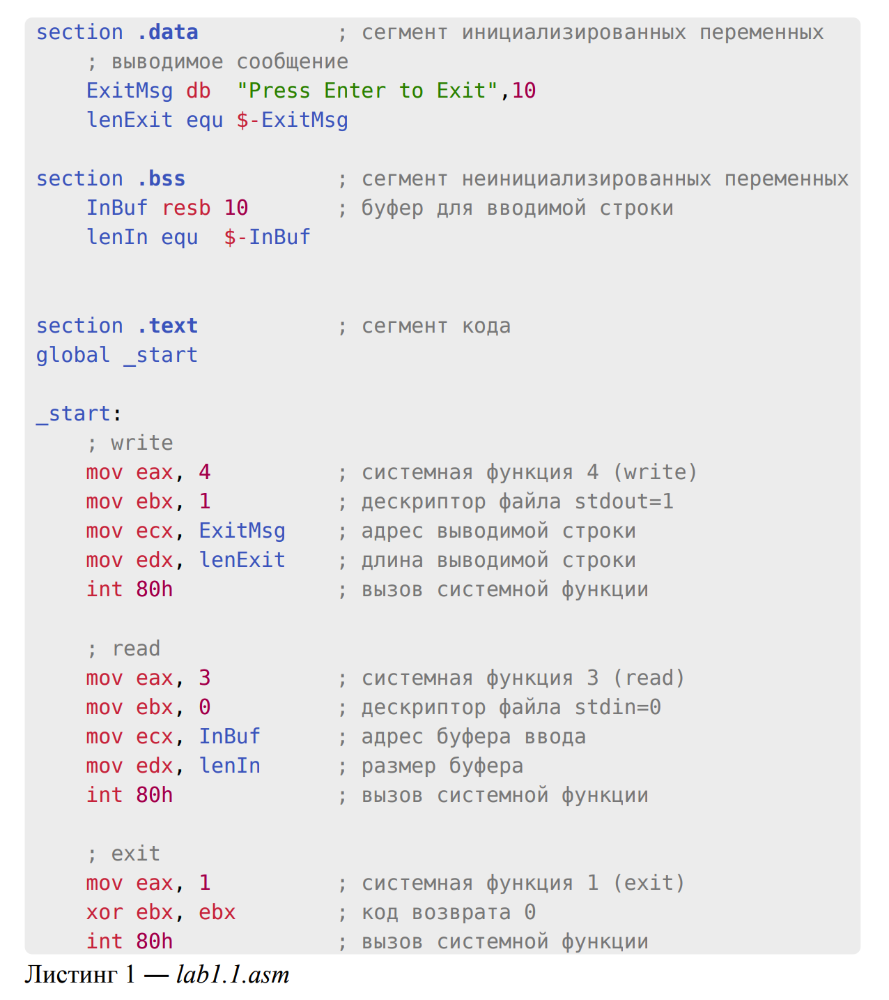
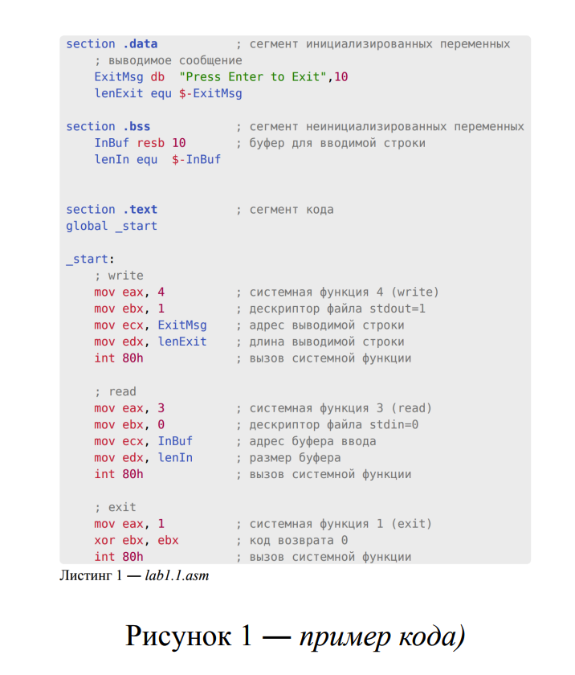

# [BMSTU typst](https://github.com/pluttan/typst-bmstu)

В данном репозитории представлены основные шаблоны работ для студентов, оформленные в типографической системе [Typst](https://typst.app):

## Установка

Склонируйте репозиторий в `$HOME`

```bash
git clone https://github.com/pluttan/typst-bmstu $HOME/typst-bmstu
```

И запустите инсталлятор (установка отличается для разных операционных систем - измените data в `install.sh` в соответствии с [документацией typst](https://github.com/typst/packages?tab=readme-ov-file#local-packages)):

```bash
~/typst-bmstu/install.sh
```

## 1. Пример студенческой работы (титульный лист, оглавление, ссылки на источники)

Использование:
```typst
#import "@docs/bmstu:1.0.0": *

#show: student_work.with(
  caf_name: "Компьютерные системы и сети",                          // Название кафедры (необязательно)
  faculty_name: "Информатика и системы управления",                 // Название факультета (необязательно)
  work_type: "домашней работе",                                     // Вид работы (в предложном падеже) и ее номер (необязательно)
  work_num: "1",
  discipline_name: "Теория графов",                                 // Название дисциплины (необязательно)
  theme: "Вариант 12. Алгоритм обхода графов в глубину",            // Тема работы (необязательно)
  author: (group: "ИБО-ТС-22", nwa: "Богданчиков К.А."),            // Автор работы и его группа
  adviser: (nwa: "Сухотерин А.В."),                                 // Преподаватель
  city: "Королёв",                                                  // Город (не обязательно)
  date: "06.11.2004",                                               // Дата (не обязательно, при отсутствии подставляется дата компиляции)
  year: "2004",                                                     // Год (не обязательно, при отсутствии подставляется год компиляции) 
  table_of_contents: true,                                          // Содержание (необязательно, по умолчанию false) 
  links: (                                                          // Ссылки (необязательно) 
    (type: "doc", title: "Доктрина информационной безопасности Российской Федерации (от 5 декабря 2016 г.)"),
    (type: "book", author: "Титов Климентий", title: "Севейна", publisher: "Литрес.Самиздат", year: "2019"),
    (type: "web", title: "Writing In Typst Tutorial", link: "https://typst.app/docs/tutorial/writing-in-typst", access_date: "22.09.2023"),
  ),
)
```
Скриншот:


## Добавленные функции
### Оформление блоков кода
Все блоки кода обормляются как тут, в отдельных, скругленных рамках. Добавлен счетчик листингов и автоматическая генерация подписей к ним. Для листингов исползуйте:
```typst
code(block_of_code, language, lable)
```
Пример:
```typst
code(read("lab1.1.asm"), "asm", "lab1.1.asm")
```
Скриншот:


### Оформление рисунков
Все рисунки оформляются с помощью
```typst
#img(image(path_img),[], f:(i)=>{i.display()})
```
Последнюю функцию использовать не обязательно, если у вас в коде нет `grid`.
Судя по всему `grid` компилируется отдельно, поэтому данная функция нужна, чтоб объеденить `grid` нумерацию и нумерацию остального документа.
```typst
#img(image("example-code.png", width: 50%),[пример кода)])
```

Скриншот:



## Парсинг кода

Код из файла может быть слишком объемным, но отказываться от удобного авторедактирования документа после изменения кода не очень хочется, поэтому предлагаю вместо этого использовать пару функций
1. `funcno` -- Введите номер строки и словарь, полученный в результате парсинга файла, на выходе функция вернет программу с совпадающим номером функции

2. `funcstr` -- Введите название функции и программа вернет всю функцию


### Ассемблерный парсинг

Для парсинга ассемблера используйте `parserassm`.

Пример:

```typst
#code(funcstr(parserasm(read("input.asm")), "stoiend:"), "asm", "ljkd")
```


